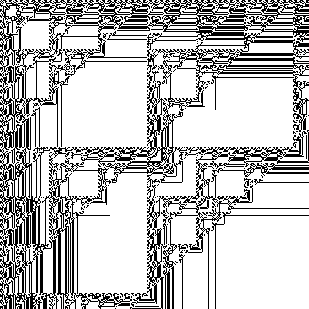

Normally when counting (let's say we're working in base 2) you carry to the left once you hit 2. But what if we carried in 2 directions instead? In this number system, carries happen to the right and up. You get some pretty patterns.

This number system contains all the natural numbers, since you can just keep adding 1. It also contains shifted versions of these numbers. Addition is quite trivial, as you just add numbers pointwise and keep carrying until there's nothing left to carry. Multiplications a x b can be defined as adding shifted copies of b together (determined by the 1s of a). I believe long division etc. is also possible.

Negatives are possible and are implemented much like negatives in 2-adic numbers.

Taking inspiration from 2-adic numbers, we can also define fractions, but interestingly enough only for odd numbers. 1/2n is impossible it seems. Below is the number 1/3 in image format (truncated as it goes on forever), where 0 is white and 1 is black. There are more examples like this in the python file provided. Feel free to uncomment them! Let me know if you find anything cool.

